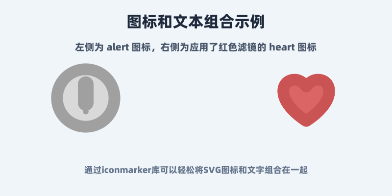

# Iconmarker

Iconmarker is a Go image-marking toolkit for generating labeled visual assets
from code. It can draw centered text on JPEG backgrounds, render embedded or
provided SVG icons, apply simple filters, and compose status badges or icon
dashboards as reproducible PNG/JPEG outputs.

Use it when you need small visual artifacts such as:

- status badges generated from text, colors, and SVG templates
- icon dashboards that combine embedded SVG icons, filters, and labels
- centered text overlays for JPEG backgrounds
- filter pipelines for grayscale, tint, opacity, and invert effects

The preview images below are checked-in documentation snapshots, not baselines.
They were copied from real example outputs after running
`bash examples/run_examples.sh`:

- `docs/assets/simple_icons_with_text.png` comes from
  `examples/icon_dashboard/output/simple_icons_with_text.png`.
- `docs/assets/badge_resolved.png` comes from
  `examples/badge/output/badge_resolved.png`.

## Preview

| Icon dashboard | Resolved badge |
| --- | --- |
|  |  |

## Install

```sh
go get github.com/bagaking/iconmarker
```

For the common compatibility API:

```go
import "github.com/bagaking/iconmarker"
```

For lower-level composition:

```go
import (
	"github.com/bagaking/iconmarker/assets"
	"github.com/bagaking/iconmarker/core"
	"github.com/bagaking/iconmarker/filter"
	"github.com/bagaking/iconmarker/renderer"
)
```

## CLI Quick Start

Iconmarker does not ship a standalone CLI. The repository examples are the
command-line entry points for generating artifacts locally:

```sh
git clone https://github.com/bagaking/iconmarker.git
cd iconmarker
go test ./...
bash examples/run_examples.sh
```

Generated files are written under each example's `output/` directory. Those
directories are ignored by git and can be regenerated at any time from the
checked-in Go code and example assets.

## API Quick Start

```go
package main

import (
	"image/color"
	"image/png"
	"log"
	"os"

	"github.com/bagaking/iconmarker"
)

func main() {
	backgroundBytes, err := os.ReadFile("background.jpg")
	if err != nil {
		log.Fatal(err)
	}

	img, err := iconmarker.CreateImg(
		nil, // nil uses the embedded default font.
		backgroundBytes,
		iconmarker.DrawTextOption{
			FontColor: color.RGBA{R: 255, G: 255, B: 255, A: 255},
			Text:      "SOLVED",
		}.SetStaticSize(48).AddOutline(color.RGBA{A: 255}, 2),
	)
	if err != nil {
		log.Fatal(err)
	}

	out, err := os.Create("output.png")
	if err != nil {
		log.Fatal(err)
	}
	defer out.Close()

	if err := png.Encode(out, img); err != nil {
		log.Fatal(err)
	}
}
```

## Example Gallery

Every gallery item below maps to files generated by
`bash examples/run_examples.sh`. See [examples/README.md](examples/README.md)
for the full output manifest.

| Example | Generates | Reproduce one example |
| --- | --- | --- |
| `examples/basic_text` | centered text overlays using the compatibility and core APIs | `cd examples/basic_text && go run main.go` |
| `examples/text_effects` | text with shadows, outlines, and combined effects | `cd examples/text_effects && go run main.go` |
| `examples/svg_rendering` | SVG rendering, resizing, and filtered SVG output | `cd examples/svg_rendering && go run main.go` |
| `examples/combined_filters` | composite, sequential, and custom filter outputs | `cd examples/combined_filters && go run main.go` |
| `examples/integrated_example` | older API, newer API, invert, and opacity outputs | `cd examples/integrated_example && go run main.go` |
| `examples/svg_with_text` | SVG/text layouts and embedded icon sheets | `cd examples/svg_with_text && go run main.go` |
| `examples/badge` | four status badge PNGs from SVG templates and text | `cd examples/badge && go run main.go` |
| `examples/icon_dashboard` | one icon dashboard PNG from embedded icons and labels | `cd examples/icon_dashboard && go run main.go` |

## Asset Provenance

- Runtime embedded assets live under `assets/`: the default font and the SVG
  icon set loaded by the `assets` package.
- Example-only inputs live under `examples/assets/`: `background.jpg`,
  `font.ttf`, and `icon.svg`.
- README preview snapshots live under `docs/assets/` and are copied from
  generated example outputs. They are kept only so the repository has an
  immediate visual preview.
- Generated example outputs live in each example's `output` directory after
  running the examples. They are ignored by git and are not treated as golden
  files.

## API Notes

- `CreateImg(fontBytes, backgroundBytes []byte, opts ...DrawTextOption)`
  decodes `backgroundBytes` as JPEG and returns an `*image.RGBA`.
- Passing `nil` or an empty slice for `fontBytes` uses the embedded default
  font. Passing bytes parses them as a TrueType font.
- `DrawTextOption.SetStaticSize` uses a fixed font size.
- `DrawTextOption.SetAdaptedSize` scales text to fit a maximum width and
  height.
- `AddShadow`, `AddOutline`, and `MoveOffset` adjust centered text rendering.
- `SaveImage2File` writes an `image.Image` with the encoder supplied by the
  caller, such as `png.Encode` or a JPEG encoder wrapper.
- `assets.IconType.Load`, `assets.GetSVGIcon`, and `assets.ListAvailableIcons`
  expose the embedded SVG icon set.

## Filters

The default filter manager registers these filter names:

- `grayscale`
- `tint`
- `opacity`
- `invert`

Example:

```go
package main

import (
	"image"
	"log"

	"github.com/bagaking/iconmarker"
	"github.com/bagaking/iconmarker/filter"
)

func applyTint(src image.Image) image.Image {
	img, err := iconmarker.ApplyFilter(src, "tint", filter.TintOption{
		Color:     [3]uint8{255, 0, 0},
		Intensity: 0.4,
	})
	if err != nil {
		log.Fatal(err)
	}
	return img
}
```

Use `iconmarker.GetFilterManager()` or `filter.NewFilterManager()` when you need
to register a custom implementation of the `filter.Filter` interface.

## Input And Output Boundaries

- Text rendering currently expects JPEG background bytes.
- Text rendering returns an RGBA image in memory; output format is chosen by the
  caller's encoder.
- Filter APIs accept `image.Image` input and return a filtered image.
- Tint intensity and opacity values must be between `0` and `1`.
- Unknown filter names return `filter.ErrFilterNotFound`.

## Validation

Run the package tests and reproducible example smoke test:

```sh
go test ./...
bash examples/run_examples.sh
git diff --check
```

`go test ./...` covers package behavior. `bash examples/run_examples.sh`
proves that every public example still compiles and can generate its documented
local outputs from checked-in inputs. Because generated outputs are ignored,
review `git status --short` before committing to confirm only intended source
or documentation files are staged.

## License

MIT. See [LICENSE](LICENSE).
